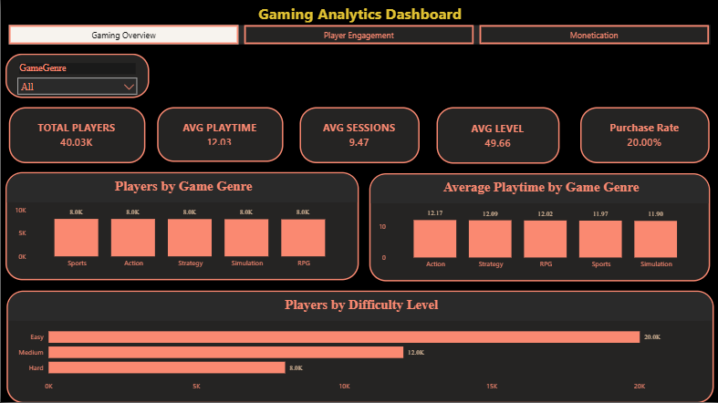
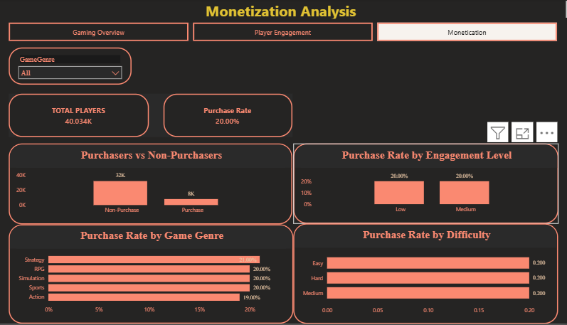
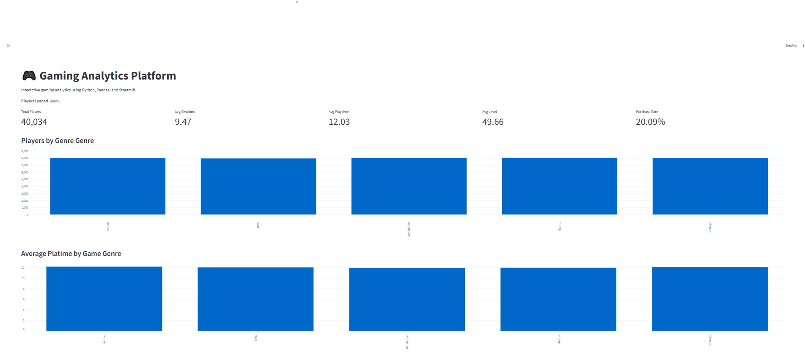
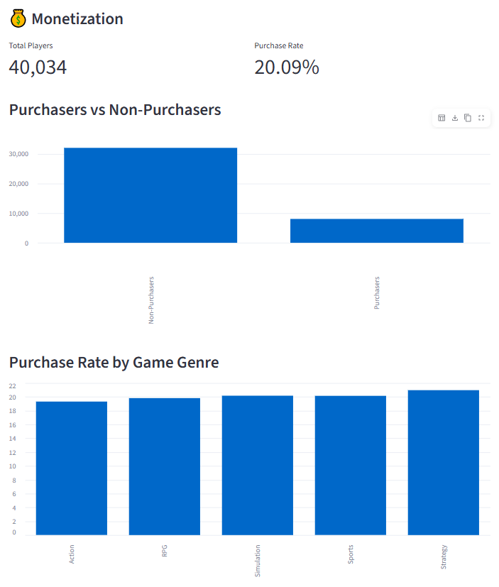
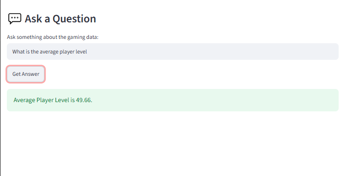

```markdown
# 🎮 Gaming Analytics Intelligence Platform

An end-to-end gaming analytics project that analyzes player behavior, engagement, gameplay activity, progression, game genres, and purchasing patterns using Excel, SQL, Python, Power BI, and Streamlit.

---

## 📌 Project Overview

The Gaming Analytics Intelligence Platform is an end-to-end data analytics project built to analyze gaming player data and transform raw player records into meaningful business insights.

The project follows a complete analytics workflow:

**Raw Data → Excel → SQL → Python/Pandas → Power BI → Streamlit**

The platform analyzes:

- Player engagement
- Gameplay behavior
- Game genre participation
- Player progression
- Purchasing behavior
- Player segmentation

---

## 🎯 Business Problem

Gaming platforms generate large amounts of player data, but raw data alone does not provide clear insights into player behavior.

This project aims to analyze player data to answer questions such as:

- How active are players?
- What are the major player engagement patterns?
- Which game genres have the highest player participation?
- How does player activity differ between segments?
- How does purchasing behavior vary across players?
- How can player progression be analyzed?
- Which player groups may require further engagement analysis?

---

## 🎯 Objectives

- Analyze player gameplay behavior.
- Measure player engagement.
- Analyze game genre participation.
- Examine player progression.
- Analyze purchasing behavior.
- Segment players based on gameplay activity.
- Create analytical reports and KPIs.
- Build an interactive Power BI dashboard.
- Develop a Streamlit analytics application.
- Provide data-driven business recommendations.

---

## 📊 Dataset

The project uses a gaming player dataset containing:

- **40,034 player records**
- **40,034 distinct PlayerIDs**
- **13 columns**
- **No missing values in the reported data-quality analysis**

### Main Columns

| Column | Description |
|---|---|
| PlayerID | Unique player identifier |
| Age | Player age |
| Gender | Player gender |
| Location | Player location |
| GameGenre | Game genre |
| PlayTimeHours | Total gameplay time |
| InGamePurchases | In-game purchase indicator |
| GameDifficulty | Game difficulty |
| SessionsPerWeek | Weekly gaming sessions |
| AvgSessionDurationMinutes | Average session duration |
| PlayerLevel | Player progression level |
| AchievementsUnlocked | Number of achievements |
| EngagementLevel | Player engagement category |

---

## 🛠️ Tools & Technologies

| Tool | Purpose |
|---|---|
| Excel | Data analysis and initial exploration |
| MySQL / SQL | Database management and business analysis |
| Python | Data processing and analysis |
| Pandas | Data manipulation and transformation |
| Power BI | Interactive dashboard and visualization |
| Streamlit | Interactive analytics application |
| VS Code | Development environment |

---

## 🔄 Project Workflow

```text
Raw Gaming Dataset
        ↓
Data Cleaning
        ↓
Excel Analysis
        ↓
MySQL Database
        ↓
SQL Analysis
        ↓
Python / Pandas
        ↓
Power BI Dashboard
        ↓
Streamlit Application
        ↓
Insights & Business Recommendations


---


## 📈 Key KPIs

The project calculates and analyzes KPIs related to:

- Total Players
- Average Playtime
- Average Sessions Per Week
- Average Player Level
- Player Engagement
- Purchase Behavior
- Player Segmentation


---


## 🔍 Key Insights

- The analysis covers **40,034 unique players**.
- Players recorded approximately **9 sessions per week on average**.
- Average player playtime was approximately **12.024 hours**.
- Approximately **48% of players belonged to the Medium Engagement category**.
- The **Action** genre had the highest number of players, with **8,039 players**.
- The reported Excel analysis identified approximately **$1,600 in revenue for the Strategy genre**.
- High-engagement players recorded the highest average playtime.
- The USA had the highest number of players in the dataset.
- Average player level was approximately **49.656**.


---


## 💡 Business Recommendations

Based on the analysis:

1. **Improve Medium-Engagement Player Activity**
   - Investigate the characteristics of the large Medium Engagement player group and evaluate opportunities to increase engagement.

2. **Study High-Engagement Players**
   - Analyze the behavior and gameplay patterns associated with highly engaged players.

3. **Monitor Action Genre Performance**
   - Since Action has the largest player population, monitor its engagement and retention patterns closely.

4. **Investigate Strategy Monetization**
   - Further analyze the purchasing and engagement behavior associated with the Strategy genre.

5. **Use Player Segmentation**
   - Analyze different gameplay segments separately instead of relying only on overall player averages.

6. **Monitor Player Progression**
   - Use player level and achievement metrics to understand progression patterns.


---


## 📊 Dashboard Preview

### Power BI Dashboard



### Power BI Analysis



### Streamlit Application



### Streamlit Analysis



### Gaming Analytics Chatbot




---


## 📁 Project Structure

GAMING ANALYTICS INTELLIGENCE PLATFORM/
│
├── DATA/
├── Documentation/
├── Excel/
├── Images/
├── PowerBI/
├── Python/
├── Reports/
├── SQL/
├── Streamlit_app/
├── .gitignore
├── README.md
└── requirements.txt


---


## ▶️ How to Run

### 1. Clone the Repository

```bash
git clone https://github.com/rohit-thakur-data/gaming-analytics-intelligence-platform.git
cd "GAMING ANALYTICS INTELLIGENCE PLATFORM"

### 2. Create a Virtual Enviroment

```bash
python -m venv .venv

### 3. Activate the Virtual Enviroment

       WindowsPowerShell
       ```PowerShell
       .\.venv\Scripts\Activate.ps1

       Windows Command Prompt
       ```cmd
       .venv\Scripts\activate.bat

### 4. Install Requirements

```bash
python -m pip install -r requirements.txt

### 5. Run Streamlit

```bash
cd Streamlit_app
python -m streamlit run app.py


---


## 📄 Project Documentation

Additional project documentation is available in the Documentation/ folder, including:

- Project Report
- Project Overview
- Data Quality Report
- Data Dictionary


---


## 📌 Project Status

Completed

The project covers the complete analytics workflow from data preparation and analysis to dashboard development and interactive Streamlit application.


---


## 🚀 Future Improvements

Potential future improvements include:

Automated data refresh
Advanced player retention analysis
More detailed player segmentation
Predictive analytics
Machine learning-based player behavior analysis
Automated reporting